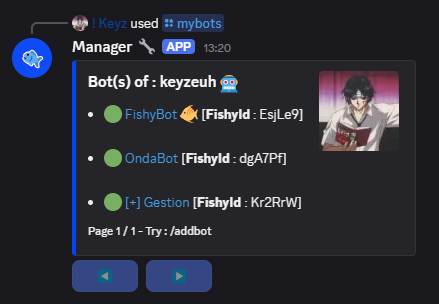
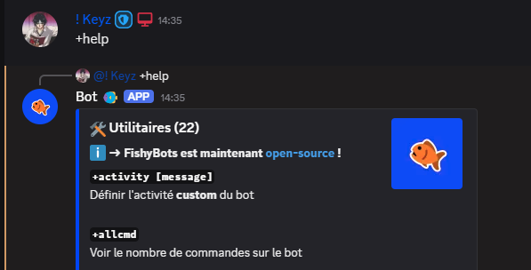

<!-- OpenFishy (c) 2025 -->


<br>
<br>
<header>
  <h1 align="center">FishyBots 🐟</h1>
  <h3 align="center">A multipurpose Discord bot with a built-in manager🔧</h3>
  
</header>

<p align="center">
  
  
  <br><br>
  <a href="https://discord.gg/RsBRuNnCVn" >
    
  </a>
</p>


<h1>Introduction</h1>

<p>
    FishyBots is a multipurpose Discord bot that includes a manager to manage multiple bots at once. This makes managing your bots much easier ! 
<p>




<h1>Features</h1>

<p>
 FishyBots comes with many features, such as:
</p>

<ul>
    <li><b>Moderation 🚨</b></li>
    <li><b>Games 🎮</b></li>
    <li><b>AntiRaid 🔐</b></li>
    <li><b>Utility 🌐</b></li>
    <li><b>Giveaways 🎉</b></li>
    <li><b>Tickets 🎫</b></li>
    <li><b>Logs 📄</b></li>
</ul>

<p>
    And more features are coming in the future! The default prefix is <code>.</code>. You can see the list of commands by typing <code>.help</code> in your server, or <code>/help</code> if you're using the manager.
</p>


<h1>Installation</h1>

> [Node.js LTS](https://nodejs.org/en/download) is required to run FishyBots.

<p>Here are the steps to install FishyBots:</p>
<p>First, you need to clone the repository:</p>
<pre><code>git clone https://github.com/fishybots/fishybots.git</code></pre>

<p>Then, you need to install the dependencies:</p>
<pre><code>npm install</code></pre>

<p>After that, you need to rename the <b>.example.env</b> to <b>.env</b> and configure it, to generate the <code>KEY</code> and <code>IV</code>. To generate the KEY and IV, run the script in the <code>script/</code> folder: </p>

<pre><code>node script/genKey.js</code></pre>

<p>And you need to set the <code>OWNER_ID</code> variable to your Discord ID, and the <code>TOKEN</code> variable to your manager bot token.</p>

> ⚠️ **Warning:** Do not share your bot token publicly!


(you can generate a token by creating a new application in the [Discord Developer Portal](https://discord.com/developers/applications))

<p>The <b>.env</b> file should look like this:</p>

```env
TOKEN = "BOT TOKEN"

KEY="dgnYp5+Dt17a1IPbl0R9i1iz2e/+m316IjnYmQhHrk4="
IV="picUug26y85nUSxHh4tJtw=="

OWNER_ID=827423070402510848
```

<p>Finally, you can run the bot with:</p>
<pre><code>npm start ./fishy/index.js</code></pre>

> ℹ️ **Warning:** If you encounter any issues, you can join the [FishyBots support server](https://discord.gg/RsBRuNnCVn).

<h1>Contributing </h1>
<p>
    If you want to contribute to FishyBots, you can fork the repository and create a pull request ! And you can put a star ⭐, to support the project
</p>
<p>
The bot is mainly translated into French. We are currently working on translating it into English.
</p>

<h1>📝 License</h1>
<p>This project is licensed under the <b>MIT License</b></p>
